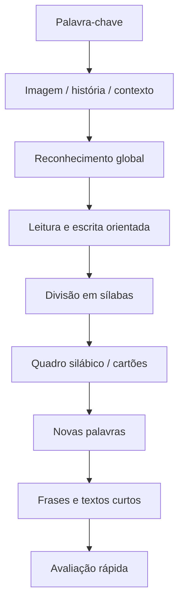

# Resumo — Método das 28 Palavras

## Ideia central

O **Método das 28 Palavras** é uma metodologia de iniciação à leitura e à escrita usada sobretudo no contexto do **1.º ciclo** e em situações de **diferenciação pedagógica**. Parte de um conjunto sequencial de **28 palavras-chave**, normalmente associadas a imagens, histórias ou situações concretas. A criança começa por reconhecer a palavra como um todo e, progressivamente, passa à sua **segmentação em sílabas**, recombinação e construção de novas palavras, frases e pequenos textos.

Não deve ser entendido como simples memorização visual de palavras. A aplicação mais sólida é **mista**: usa a palavra significativa como ponto de entrada, mas precisa de trabalhar explicitamente consciência silábica, correspondências grafofonémicas, leitura de palavras novas e escrita.

## Origem e enquadramento

A origem histórica mais referida liga o método à educadora brasileira **Yolanda Betim Paes Leme de Kruel** e à *Cartilha Moderna*, cuja lógica assentava em palavras-tipo escolhidas para concentrar sons/regularidades da língua e serem fáceis de representar por desenho. Em Portugal, o método ganhou circulação através de materiais escolares e propostas editoriais, com destaque para projetos como **O Mundo das Palavras** / **O Novo Mundo das Palavras**, da Porto Editora.

A Porto Editora apresenta o projeto como uma aplicação do Método das 28 Palavras para Português do 1.º ano, articulada com Aprendizagens Essenciais e Perfil do Aluno, valorizando consciência silábica, quadros silábicos, formação de palavras, leitura cronometrada, compreensão de textos e materiais manipuláveis como cartazes, cartões e silabário.

## Sequência típica de trabalho

Um ciclo de introdução de uma palavra pode seguir esta estrutura:

1. **Motivação/contexto**  
   História curta, imagem, objeto, conversa ou situação próxima da criança.

2. **Apresentação da palavra**  
   Palavra + imagem; leitura orientada; reconhecimento global.

3. **Leitura e escrita da palavra**  
   Correspondência imagem-palavra, cópia, identificação em cartões ou textos curtos.

4. **Segmentação silábica**  
   Dividir a palavra em sílabas; bater palmas; manipular cartões silábicos.

5. **Recombinação**  
   Usar sílabas já conhecidas para formar novas palavras ou pseudopalavras.

6. **Frases e texto**  
   Construir frases simples e pequenos textos com vocabulário já trabalhado.

7. **Verificação rápida**  
   Ler a palavra-alvo, ler palavras novas formadas por sílabas conhecidas e escrever uma palavra/frase curta.

## As 28 palavras

Há pequenas variações históricas e editoriais na lista. A sequência usada no nosso trabalho/PageCraft e alinhada com materiais portugueses recentes é:

1. menina  
2. menino  
3. uva  
4. dedo  
5. sapato  
6. bota  
7. leque  
8. casa  
9. janela  
10. telhado  
11. escada  
12. chave  
13. galinha  
14. ovo  
15. rato  
16. cenoura  
17. girafa  
18. palhaço  
19. zebra  
20. bandeira  
21. funil  
22. árvore  
23. quadro  
24. passarinho  
25. peixe  
26. cigarra  
27. fogueira  
28. flor

Nalgumas fontes aparecem variantes como **mamã** em vez de **dedo** ou **gema** em vez de **ovo**. Convém tratar a lista como uma tradição didática com variantes, não como cânone único universal.

## O que a evidência sugere

A evidência disponível é sobretudo composta por **dissertações, estudos de caso e investigação-ação**, não por ensaios experimentais robustos. Ainda assim, há relatos portugueses de intervenção com alunos com dificuldades de aprendizagem que mostram melhorias em reconhecimento de palavras, descodificação, motivação, autoestima e participação.

Exemplos encontrados:

- **Silva (2019)** descreve uma intervenção com uma criança do 1.º ano ao longo de dois períodos. A avaliação antes/depois usou a **Prova de Reconhecimento de Palavras (PRP)** e leitura de texto. A autora reporta evolução significativa na leitura e melhoria de autoestima/motivação.
- **Duarte (2018)** estudou dois alunos do 2.º ano com dificuldades de aprendizagem, num desenho de investigação-ação/estudo de caso. A intervenção decorreu ao longo de dois trimestres e usou a PRP em quatro momentos. O autor reporta melhorias consistentes, sobretudo na decifração do código escrito, mas reconhece que a compreensão/interpretação ainda exigia trabalho.
- **Dinis (2011)** enquadra o método como misto e discute a sua aplicação a crianças com necessidades educativas especiais/dificuldades de aprendizagem, sobretudo quando não adquiriram leitura por abordagens sintético-analíticas.

Leitura prudente: os resultados são promissores para **intervenção diferenciada**, mas não provam, por si só, superioridade geral do método. Podem estar misturados com outros fatores: mais tempo individual, materiais novos, apoio familiar, motivação acrescida e acompanhamento mais sistemático.

## Cuidados importantes

### 1. Evitar uso puramente global/visual

O maior risco é a criança memorizar a forma visual das palavras sem compreender o funcionamento alfabético. O método deve ser usado com trabalho explícito de:

- consciência fonológica e silábica;
- relação som-letra;
- leitura de palavras novas;
- escrita orientada e autónoma;
- generalização para frases e textos.

### 2. Dislexia: cautela reforçada

Na literatura clínica sobre dislexia, métodos globais ou puramente visuais são desaconselhados. Um artigo da *Revista Portuguesa de Medicina Geral e Familiar* refere que, na dislexia, a intervenção deve assentar em treino fonológico e reeducação da leitura com método fónico, criticando métodos globais, incluindo o das 28 palavras, quando usados como abordagem principal.

Isto não impede que as 28 palavras sejam usadas como **suporte motivacional ou contextual**, mas, perante suspeita de dislexia, não devem substituir uma intervenção fónica/fonológica estruturada.

### 3. Avaliar generalização, não só memorização

Para perceber se há aprendizagem real, convém observar se a criança consegue:

- ler a palavra trabalhada;
- ler palavras novas formadas com sílabas conhecidas;
- escrever palavras/frases sem apenas copiar;
- ler pequenos textos não memorizados;
- compreender o que lê.

## Checklist prática para o professor

### Antes da sessão

- [ ] Palavra-alvo definida.
- [ ] Imagem/cartaz preparado.
- [ ] Cartões silábicos ou quadro silábico disponíveis.
- [ ] Frases simples preparadas com vocabulário conhecido.
- [ ] Critério de sucesso definido: leitura, escrita e recombinação.

### Durante a sessão

- [ ] Começar por contexto significativo.
- [ ] Mostrar palavra + imagem.
- [ ] Ler e escrever com apoio.
- [ ] Dividir em sílabas.
- [ ] Recombinar sílabas.
- [ ] Construir frases.
- [ ] Fazer verificação curta no final.

### Depois da sessão

- [ ] Registar erros recorrentes.
- [ ] Verificar se houve generalização para palavras novas.
- [ ] Reforçar relações som-letra quando necessário.
- [ ] Ajustar ritmo antes de avançar para nova palavra.

## Síntese curta

O Método das 28 Palavras é útil quando funciona como **roteiro estruturado, concreto e motivador** para iniciar ou recuperar leitura e escrita. O seu valor está na combinação entre palavra significativa, imagem, manipulação silábica, recombinação e produção de frases/textos. O seu limite aparece quando é usado como memorização global de palavras, sem ensino explícito do código alfabético. Para alunos com dificuldades persistentes, especialmente suspeita de dislexia, deve ser articulado com intervenção fónica/fonológica e avaliação sistemática.

## Fontes usadas

### Base interna da KB

- [[2026-03-17-metodo-das-28-palavras-origem-variantes-aplicacao-e-evidencia]]

### Pesquisa web complementar

- Porto Editora — *O Novo Mundo das Palavras: Aplicação do Método das 28 Palavras*: https://www.portoeditora.pt/especiais/mundo-palavras
- Porto Editora — *O Novo Mundo das Palavras - Português - 1.º Ano*: https://www.portoeditora.pt/produtos/ficha/o-novo-mundo-das-palavras-portugues-1-ano/29490595
- Porto Editora — *Materiais Pedagógicos de Apoio - Método das 28 Palavras*: https://www.portoeditora.pt/produtos/ficha/o-novo-mundo-das-palavras-materiais-pedagogicos-de-apoio-metodo-das-28-palavras-portugues-1-ciclo/32285413
- Silva, A. S. S. (2019). *A implementação do método das 28 palavras: descrição de uma intervenção*. Repositório Comum: http://hdl.handle.net/10400.26/29049
- Duarte, L. A. L. (2018). *Ensino da leitura a alunos com dificuldades de aprendizagem através do método das 28 palavras*. Repositório Comum: http://hdl.handle.net/10400.26/21900
- Dinis, M. F. M. V. (2011). *Abordagem crítica ao método das 28 palavras em crianças com dificuldades de aprendizagem*. uBibliorum: http://hdl.handle.net/10400.6/2111
- Revista Portuguesa de Medicina Geral e Familiar — dossier neurodesenvolvimento infantil/dislexia: https://rpmgf.pt/ojs/index.php/rpmgf/pt/article/download/10696/10432/10612
